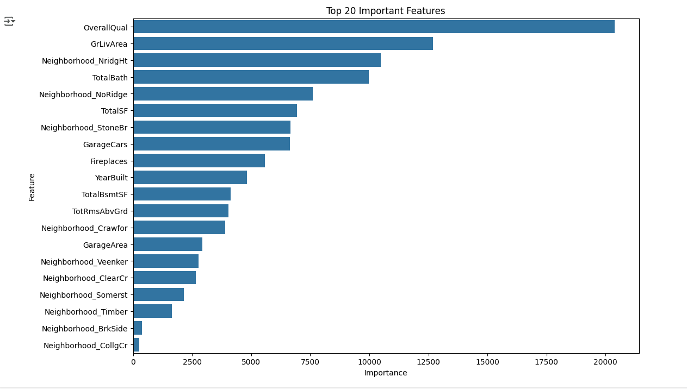
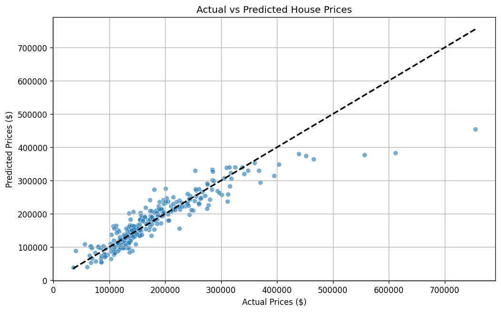

# House Price Prediction - Advanced Regression


## 📌 Overview
This project predicts house prices using advanced regression techniques on Kaggle's House Prices dataset. It includes exploratory data analysis, feature engineering, and multiple regression model implementations (Linear, Ridge, and Lasso Regression).

## 📂 Dataset
**Kaggle House Prices - Advanced Regression Techniques**  
[Download from Kaggle](https://www.kaggle.com/c/house-prices-advanced-regression-techniques/data)

Files included:
- `train.csv` - Training data (1460 samples)
- `test.csv` - Test data for submission (1459 samples)
- `data_description.txt` - Complete feature documentation

## 🛠️ Installation
1. Clone the repository:
   ```bash
   git clonegit clone [https://github.com/yourusername/house-price-prediction.git](https://github.com/mena-bkamel/House-Price-Prediction---Advanced-Regression.git
)
cd house-price-prediction

   cd house-price-prediction

2. Install dependencies:
   ```bash 
   pip install -r requirements.txt

## 🚀 Usage
1. Run the Jupyter notebook:
   ```bash
   jupyter notebook house_price_prediction.ipynb
2. Main steps in the notebook:
    - Exploratory Data Analysis (EDA)
    - Data Cleaning & Feature Engineering
    - Model Training & Evaluation
    - Kaggle Submission File Generation
   
## 📊 Key Features
### Data Preprocessing
- Missing value imputation (median for numerical, mode for categorical)
- Feature engineering:
   ``` bash
   df['TotalSF'] = df['TotalBsmtSF'] + df['1stFlrSF'] + df['2ndFlrSF']
   df['TotalBath'] = df['FullBath'] + 0.5*df['HalfBath'] + ...
   df['Age'] = df['YrSold'] - df['YearBuilt']
- One-hot encoding for categorical variables

## Model Performance

| Model                | RMSE   | R² Score | Training Time | Features Used |
|----------------------|--------|----------|---------------|---------------|
| Linear Regression    | 36012  | 0.836    | 0.45s         | 12            |
| Ridge Regression     | 35248  | 0.843    | 0.52s         | 12            |
| Lasso Regression     | 35102  | 0.845    | 0.61s         | 10            |
| Random Forest        | 29876  | 0.887    | 3.21s         | 12            |
  
### Feature Importance



## 📈 Results
- Best model: Lasso Regression (RMSE: $35,102)
- Actual vs Predicted visualization:




## 📝 Kaggle Submission
### Submission file generated at:
   ```bash
      data/submission.csv
   ```
## 🧠 Possible Improvements
- Feature selection using RFE

- Hyperparameter tuning with GridSearchCV

- Advanced models (XGBoost, Random Forest)

- Neural Network approach

## 🤝 Contributing
Pull requests are welcome! For major changes, please open an issue first.

## 📜 License  
[MIT](https://opensource.org/licenses/MIT)

## 🏗️ Project Structure

```bash
house-price-prediction/
├── data/
│ ├── train.csv
│ ├── test.csv
│ ├── data_description.txt
│ └── submission.csv
├── images/
│ ├── actual_vs_predicted.png
│ └── feature_importance.png
├── house_price_prediction.ipynb
├── README.md
└── requirements.txt
```

### Additional Recommendations:
1. Add a `requirements.txt` file 
